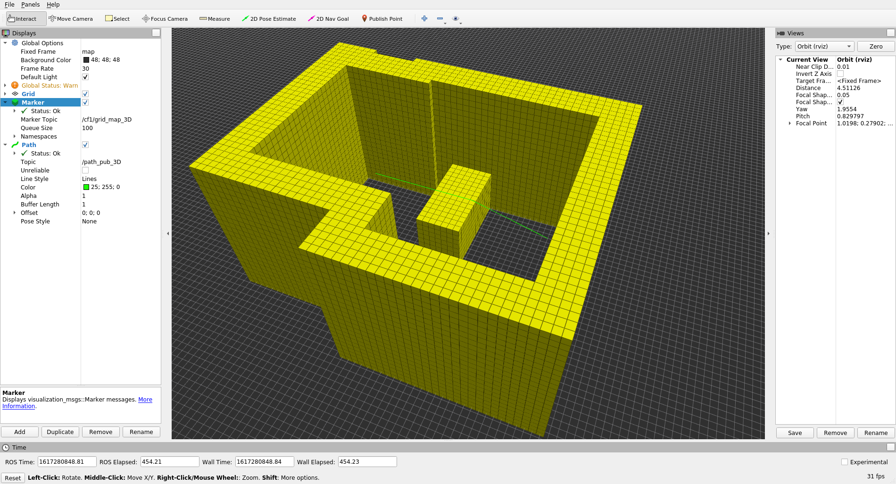

# path_planning_3d
Implementation of 3D path planning using A* algorithm and Python. Can be used in ROS through a service.

## GridMap3D 
Reads a map json file (see map package for format) and builds a 3D grid representation and inflates the obstacles by a given radius.
It expects a path to the map file, the desired map resolution and a radius for map inflation. It can generate a ROS Marker message to visualize the 
map in Rviz with different colors for obstacles and c-space. It also provides a raycast that returns all visited map nodes between a given start and end point
using Besenhams line drawing algorithm in 3D.

## AStar3D
Performs A* algorithm on a given GridMap3D and start and end positions. It provides a method to sparsen the found path to include as little waypoints as necessary.

## grid_map_3D_publisher
Reads a map file and publishes the map visualization to a ROS topic.

## path_server_3D
ROS service that can be called to request a path between a start and end position.

## test_service_3D
Can be used to test the path_server_3D. Requests a path from the server and publishes the found path on a topic.
